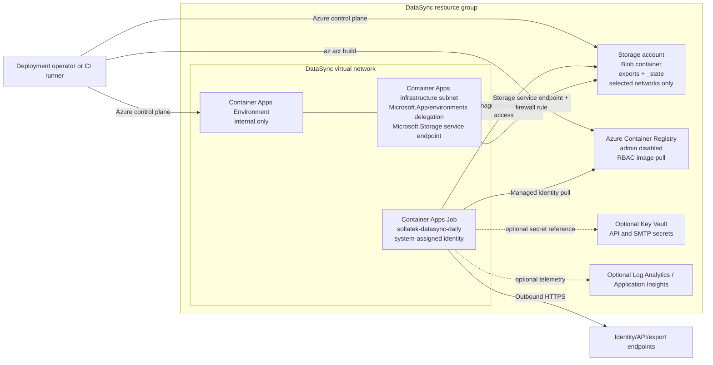

# Azure Deployment Low-Level Design

This document defines the Azure resources, network topology, identity model, RBAC assignments, and deployment sequence required to run Sollatek DataSync as a scheduled Azure Container Apps Job that exports files to Azure Blob Storage.

The deployment is designed for no public inbound access to the DataSync workload. The Container Apps Environment is VNet-integrated and internal, the app reaches the internet only through outbound HTTPS, and Azure Blob Storage is restricted to selected networks by a storage firewall rule for the Container Apps subnet.

## Audience and Handoff Purpose

This document is intended for cloud platform, architecture, and network teams that need to review or build the Azure landing zone for DataSync. It describes what must exist in Azure, which parts the deployment script can create, and which permissions or network rules must be approved before the scheduled job can run.

## Application Overview

Sollatek DataSync is a containerized export worker. It authenticates to the Sollatek platform API, submits or reads configured exports, downloads the completed export files, and writes them to Azure Blob Storage using the configured folder and file naming policy. In the daily Azure deployment, the app runs as a finite scheduled job, processes the due historical or daily export windows, saves export files such as Parquet under date-based folders, stores sync state in Blob Storage so it can resume after interruption, then exits.

The app is not a public web service. It has no inbound user traffic requirement. Runtime traffic is outbound HTTPS to identity/API/export endpoints, Azure Container Registry image pull, Azure Blob Storage writes and reads, and optional SMTP or monitoring endpoints when configured.

## Scope

The Azure design covers:

- Azure Container Apps Job running DataSync on a daily schedule.
- Azure Container Registry for the DataSync image.
- Azure Blob Storage for exported files and DataSync state.
- Optional VNet and Container Apps subnet creation.
- Storage service endpoint and storage firewall rule for the Container Apps subnet.
- Optional Databricks subnet connection to the same Storage account using service endpoints and storage firewall rules.
- Managed identity based runtime access to ACR and Blob Storage.
- Optional Key Vault-backed secrets.
- RBAC required for deployment, runtime, and operations.

## External Dependencies and Inputs

These items are required inputs or separately owned platform decisions. They are listed here so the cloud team can assign them before deployment:

| Item | Owner | Required decision or input |
| --- | --- | --- |
| Subscription and region | Cloud architecture | Target subscription, resource group naming, Azure region, and tagging policy. |
| CIDR allocation | Network team | VNet and Container Apps subnet ranges that do not overlap existing hub, spoke, VPN, ExpressRoute, or other application ranges. |
| Outbound routing | Network team | Whether default Azure outbound routing is acceptable, or whether corporate firewall/NAT/route tables are required outside this deployment script. |
| Platform API access | Application/API team | API base URL, identity URL, client key, and client secret delivery method. |
| Blob container lifecycle | Cloud/storage team | Whether the deployment script creates the container or the container is pre-created from an allowed network. |
| Secret storage | Security/cloud team | Environment variables for deployment-time injection or Key Vault references for production secrets. |
| Monitoring target | Operations/cloud team | `none`, Log Analytics, Application Insights, Azure Monitor, or another approved sink. |
| Databricks integration | Data platform team | Existing Databricks VNet/subnets and the principal that should receive Blob access. |

## Assumptions

- The job runs once per day at `01:00` UTC using Container Apps schedule cron `0 1 * * *`.
- DataSync exits after processing the historical backlog for the run.
- Exported files and state are stored in one Azure Blob container.
- The deployment script is `deployment/azure/deploy-containerapps-job.ps1`.
- The optional Databricks storage connector script is `deployment/azure/connect-databricks-storage.ps1`.
- The example deployment config is `deployment/azure/deploy.daily.azure-containerapps-job.json`.
- The example Databricks storage connector config is `deployment/azure/connect.databricks-storage.json`.
- Existing Azure resources are reused but not reconfigured unless the script owns that specific setting.
- The blob container is created before deployment, or `storage.skipContainerSetup=false` is used only from a machine allowed by the storage firewall.
- The DataSync app requires outbound HTTPS to identity, API, export download, ACR, and optional SMTP/monitoring endpoints.

## Architecture Decisions

| Decision | Value | Reason |
| --- | --- | --- |
| Compute | Azure Container Apps Job | The workload is finite, scheduled, and exits after each run. |
| Trigger | Schedule cron in UTC | Azure Container Apps scheduled jobs use five-field cron expressions evaluated in UTC. |
| Inbound access | None to the job | DataSync is a worker, not a public service. |
| Environment network | Internal Container Apps Environment integrated with a VNet | Keeps the workload inside the subscription network boundary for inbound exposure. |
| Storage network control | Storage selected networks with VNet rules | Allows only approved subnets while keeping storage authorization enforced by Microsoft Entra/RBAC. |
| Storage route from VNet | `Microsoft.Storage` service endpoint | Avoids public source IP allowlists and keeps Azure service traffic on the Azure backbone. |
| Runtime identity | System-assigned managed identity on the job | Removes ACR and Blob credentials from the container. |
| Runtime storage state | Blob-backed state under `_state` | Allows the job to resume from the last saved sync/export state across executions. |
| Image source | Azure Container Registry with admin disabled | Uses RBAC and managed identity for image pull. |

## Target Architecture



## Resource Inventory

| Resource | Required | Created by script | Notes |
| --- | --- | --- | --- |
| Resource group | Yes | Yes, if missing | Uses configured location and tags. |
| Virtual network | Yes, unless pre-created | Yes, when `network.skipSetup=false` | Existing VNets are reused. |
| Container Apps infrastructure subnet | Yes | Yes, when `network.skipSetup=false` | Delegated to `Microsoft.App/environments`. |
| Storage service endpoint on subnet | Yes, when script manages network | Yes, when `network.skipSetup=false` | Uses `network.storageServiceEndpoint`, default `Microsoft.Storage`. |
| Storage account | Yes | Yes, if missing | Created with HTTPS only, TLS 1.2 minimum, blob public access disabled, default network action deny, and no bypass. |
| Storage firewall subnet rule | Yes, when script manages network | Yes, when `network.skipSetup=false` | Allows the Container Apps subnet. |
| Databricks storage firewall subnet rule | Optional | Yes, by `connect-databricks-storage.ps1` | Allows explicitly configured Databricks VNet subnets. |
| Blob container | Yes | Optional | Included daily config sets `storage.skipContainerSetup=true`; create the container before deployment. |
| Azure Container Registry | Yes | Yes, if missing | Admin user disabled. Runtime image pull uses managed identity and `AcrPull`. |
| Container Apps Environment | Yes | Yes, if missing | New environments use the configured subnet and `--internal-only true` by default. |
| Container Apps Job | Yes | Yes, if missing | Existing jobs are not changed unless `containerApps.updateExistingJob=true`. |
| System-assigned managed identity | Yes | Yes | Assigned to the job. |
| Runtime RBAC | Yes | Yes | `AcrPull` on ACR and `Storage Blob Data Contributor` on the storage account. |
| Key Vault | Optional | No | Use Container Apps Key Vault references if required. |
| Log Analytics / Application Insights | Optional | No | Included daily config uses `logsDestination=none`. |

## Build Requirements by Team

| Team | Must provide or validate |
| --- | --- |
| Cloud platform | Subscription, resource group policy, naming policy, ACR, Container Apps Environment, Container Apps Job, managed identity, tags, and deployment execution process. |
| Network | VNet/subnet CIDR, subnet delegation, selected-network storage rule, service endpoint, route table/NSG compatibility, and outbound HTTPS policy. |
| Storage | Storage account, blob container, network firewall settings, retention/lifecycle policy if required, and Blob RBAC scope. |
| Security/IAM | Deployment identity permissions, runtime managed identity permissions, Key Vault or secret injection process, and approval for who can manually start job executions. |
| Data platform | Databricks subnet details and storage access principal if Databricks will read the same Blob container. |
| Operations | Monitoring destination, alerting expectations, runbook ownership, and failed-job triage process. |

## Network Design

### CIDR Plan

The values below are examples. The cloud team must allocate ranges that do not overlap hub, spoke, VPN, ExpressRoute, or other application networks.

| Network item | Example | Notes |
| --- | --- | --- |
| VNet | `10.70.0.0/16` | Dedicated or shared application spoke. |
| Container Apps infrastructure subnet | `10.70.0.0/23` | Dedicated to the Container Apps Environment. |

### Storage Access

The script uses Azure Storage selected-network access:

- `allowBlobPublicAccess=false`
- `defaultAction=Deny`
- `bypass=None`
- `publicNetworkAccess=Enabled`
- VNet rule for the Container Apps subnet
- `Microsoft.Storage` service endpoint on the Container Apps subnet

This means the storage account still uses the normal Azure Storage service address and DNS behavior, but access is denied unless the request comes from an allowed network rule and has valid authorization. The job still needs `Storage Blob Data Contributor`; the network rule alone is not enough.

Network team acceptance criteria:

- The Container Apps subnet is dedicated to the Container Apps Environment.
- The Container Apps subnet is delegated to `Microsoft.App/environments`.
- The Container Apps subnet has the `Microsoft.Storage` service endpoint enabled.
- The storage account network default action is `Deny`.
- Storage trusted service bypass is `None`, unless a separately approved monitoring or governance requirement needs it.
- The storage account has a VNet rule for the Container Apps subnet.
- No public inbound route is required or configured for the Container Apps Job.
- Outbound HTTPS from the job is allowed to Microsoft Entra ID, the Sollatek platform API/export endpoints, ACR, Blob Storage, and optional SMTP/monitoring endpoints.

For an existing Databricks workspace that needs the same storage account, use `deployment/azure/connect-databricks-storage.ps1` with `deployment/azure/connect.databricks-storage.json`. For VNet-injected compute, configure the Databricks VNet and compute subnet names explicitly. The connector script enables the Storage service endpoint on those subnets, adds storage firewall subnet rules, and can assign Storage Blob RBAC to a configured Databricks access principal.

### Container Apps Environment

New environments are created with:

- `--infrastructure-subnet-resource-id <container-apps-subnet-id>`
- `--internal-only true` by default
- `--logs-destination none` in the included config

The job does not expose HTTP ingress. It only needs outbound HTTPS for identity, API calls, export downloads, image pull, Blob writes, and optional SMTP/monitoring.

## Configuration

The included daily deployment config uses this network shape:

```json
"network": {
  "skipSetup": false,
  "vnetName": "vnet-sollatek-datasync-prod",
  "addressPrefix": "10.70.0.0/16",
  "containerAppsSubnetName": "snet-sollatek-datasync-containerapps",
  "containerAppsSubnetPrefix": "10.70.0.0/23",
  "containerAppsInternalOnly": true
}
```

Set `network.skipSetup=true` only when the VNet, Container Apps subnet, service endpoint, storage firewall rules, and Container Apps environment network settings are already handled outside this script.

The included daily storage config sets:

```json
"storage": {
  "accountName": "stsollatekdsync001",
  "containerName": "sollatek-datasync",
  "sku": "Standard_LRS",
  "kind": "StorageV2",
  "containerSetupAuth": "key",
  "skipContainerSetup": true
}
```

Keep `skipContainerSetup=true` when the deployment machine is not allowed by the storage firewall. Create the blob container before running the deployment script.

## Deployment Sequence

1. Confirm subscription, region, naming, tags, and CIDR ranges.
2. Create or select the DataSync resource group.
3. Create or select the ACR and keep the admin user disabled.
4. Create or select the storage account and blob container.
5. Prepare platform API credentials as environment variables or Key Vault references.
6. Review `deployment/azure/deploy.daily.azure-containerapps-job.json`.
7. Run a plan:

```powershell
.\deployment\azure\deploy-containerapps-job.ps1 `
  -ConfigPath .\deployment\azure\deploy.daily.azure-containerapps-job.json `
  -PlanOnly
```

8. Deploy:

```powershell
.\deployment\azure\deploy-containerapps-job.ps1 `
  -ConfigPath .\deployment\azure\deploy.daily.azure-containerapps-job.json
```

9. Confirm the job has `AcrPull` on ACR and `Storage Blob Data Contributor` on the storage account.
10. Start one manual job execution only when credentials, storage container, and network rules are ready.

## Optional Databricks Storage Connection

Use this only for an existing Databricks workspace that should read the same Blob container.

1. Identify the Databricks VNet resource group, VNet name, and compute subnet names that should reach Storage.
2. Identify the Databricks access principal object ID. For Unity Catalog this is usually the managed identity behind the Databricks access connector or the principal used by the external location.
3. Update `deployment/azure/connect.databricks-storage.json`.
4. Run a plan:

```powershell
.\deployment\azure\connect-databricks-storage.ps1 `
  -ConfigPath .\deployment\azure\connect.databricks-storage.json `
  -PlanOnly
```

5. Apply the connection:

```powershell
.\deployment\azure\connect-databricks-storage.ps1 `
  -ConfigPath .\deployment\azure\connect.databricks-storage.json
```

The connector script:

- Validates the configured storage account.
- Optionally validates the configured Databricks workspace when `workspaceName` and `workspaceResourceGroup` are provided.
- Validates that each configured Databricks subnet already exists.
- Enables the configured Storage service endpoint on each Databricks subnet.
- Adds each Databricks subnet to the storage account network rules.
- Optionally assigns Storage Blob RBAC to configured principals at storage account or container scope.
- Does not create Databricks workspaces, VNets, subnets, clusters, external locations, or notebooks.

Set `storage.enforceSelectedNetworks=true` only when the script is allowed to apply `publicNetworkAccess=Enabled`, `defaultAction=Deny`, and `bypass=None` on the storage account. Otherwise, the script adds the subnet rules and warns if the storage account is not already using selected-network restrictions.

## Deployment Permissions

The deployment identity needs enough Azure permissions to create or manage:

- Resource group.
- VNet and subnet, when `network.skipSetup=false`.
- Storage account and storage network rules.
- Azure Container Registry.
- Container Apps Environment and Job.
- Role assignments for the job managed identity.

Minimum built-in role planning depends on how your cloud team separates duties. A typical split is:

| Scope | Role | Purpose |
| --- | --- | --- |
| Subscription or target resource group | Contributor | Create resource group resources except role assignments. |
| Subscription, resource group, ACR, and storage scopes | User Access Administrator or Role Based Access Control Administrator | Assign `AcrPull` and `Storage Blob Data Contributor`. |
| VNet scope | Network Contributor | Create VNet/subnet and configure service endpoint. |
| Storage account scope | Storage Account Contributor | Create/update storage account and network rules. |
| Databricks VNet scope | Network Contributor | Enable Storage service endpoints on the configured Databricks subnets. |
| Databricks storage access principal scope | User Access Administrator or Role Based Access Control Administrator | Assign optional Storage Blob RBAC when configured. |

The deployment identity also needs Azure CLI access from a machine or Cloud Shell session that can reach Azure control plane endpoints. If `storage.skipContainerSetup=false`, that same execution location must also be allowed by the storage firewall or use credentials from an allowed network path to create the blob container.

## Runtime RBAC

The Container Apps Job system-assigned identity receives:

- `AcrPull` on the ACR.
- `Storage Blob Data Contributor` on the storage account.

Scope the storage assignment to the blob container instead of the storage account if your governance process requires narrower access and the container exists before role assignment.

## Operations

Useful checks:

```powershell
az containerapp job show `
  --resource-group <resource-group> `
  --name <job-name> `
  --query "{name:name,trigger:configuration.triggerType,schedule:configuration.scheduleTriggerConfig.cronExpression,identity:identity.principalId}"

az storage account show `
  --resource-group <resource-group> `
  --name <storage-account> `
  --query "{publicNetworkAccess:publicNetworkAccess,defaultAction:networkRuleSet.defaultAction,bypass:networkRuleSet.bypass,subnetRules:networkRuleSet.virtualNetworkRules[].virtualNetworkResourceId}"

az network vnet subnet show `
  --resource-group <resource-group> `
  --vnet-name <vnet-name> `
  --name <container-apps-subnet-name> `
  --query "{delegations:delegations[].serviceName,serviceEndpoints:serviceEndpoints[].service}"
```

## Troubleshooting

| Symptom | Likely cause | Checks |
| --- | --- | --- |
| Job cannot write blobs | Missing RBAC, missing container, or storage firewall rule does not include the Container Apps subnet | Check job identity role assignment, container existence, subnet service endpoint, and storage network rules. |
| Job cannot pull image | Missing `AcrPull`, wrong registry server, or image tag missing | Check job identity, registry setting, image tag, and ACR repository list. |
| Deployment cannot create blob container | Deployment machine is not allowed by storage firewall | Keep `storage.skipContainerSetup=true` and create the container from an allowed environment. |
| Job does not run on schedule | Cron expression or job trigger configuration is wrong | Check `containerApps.cronExpression` and job schedule trigger config. |
| Existing job is not updated | `containerApps.updateExistingJob=false` | Set it to `true` only for an intentional redeploy. |

## Cost Estimate

Network-only estimate for the daily export scenario: `$0/month` for the resources created by the simplified network path:

- VNet.
- Container Apps infrastructure subnet.
- `Microsoft.Storage` service endpoint.
- Storage firewall subnet rule.

This estimate assumes:

- Container Apps and Storage are deployed in the same Azure region.
- No VNet peering, NAT Gateway, Azure Firewall, VPN Gateway, ExpressRoute, Load Balancer, public IP addresses, or other paid networking services are added outside the script.
- The job downloads export files from the platform into Azure, which is inbound data transfer to Azure.
- The job writes files to Blob Storage in the same Azure region.
- Container Apps environment networking does not introduce a separate dedicated network appliance in this design.

Costs excluded from this network-only estimate:

- Container Apps Job vCPU/memory execution.
- ACR build and image storage.
- Blob Storage capacity, read/write/list transactions, and lifecycle operations.
- Log Analytics, Application Insights, Key Vault, SMTP, firewall, NAT, VPN, ExpressRoute, or any manually added shared infrastructure.
- Internet egress from Azure if the job sends data out to public endpoints. Current public Azure pricing includes the first 100 GB/month of internet egress free, then charges the published regional bandwidth rates.

## Security Requirements

- Use managed identity for runtime ACR and Blob access.
- Keep ACR admin user disabled.
- Do not store storage keys or API client secrets in source control.
- Prefer Key Vault references for production secrets.
- Keep storage default network action denied and allow only required subnets.
- Scope runtime blob RBAC to the blob container where possible.
- Keep Container Apps Job parallelism at `1` for a single shared state prefix.
- Use immutable image tags for deployments.
- Restrict who can run or override job executions because each execution can access configured job secrets.

## Microsoft References

- [Jobs in Azure Container Apps](https://learn.microsoft.com/en-us/azure/container-apps/jobs)
- [Provide a virtual network to an Azure Container Apps environment](https://learn.microsoft.com/en-us/azure/container-apps/vnet-custom)
- [Networking in an Azure Container Apps Environment](https://learn.microsoft.com/en-us/azure/container-apps/networking)
- [Managed identities in Azure Container Apps](https://learn.microsoft.com/en-us/azure/container-apps/managed-identity)
- [Azure Container Apps image pull from Azure Container Registry with managed identity](https://learn.microsoft.com/en-us/azure/container-apps/managed-identity-image-pull)
- [Manage secrets in Azure Container Apps](https://learn.microsoft.com/en-us/azure/container-apps/manage-secrets)
- [Azure Storage firewall rules](https://learn.microsoft.com/en-us/azure/storage/common/storage-network-security)
- [Azure Virtual Network pricing](https://azure.microsoft.com/en-us/pricing/details/virtual-network/)
- [Azure Bandwidth pricing](https://azure.microsoft.com/en-us/pricing/details/bandwidth/)
- [Azure Virtual Network service endpoints](https://learn.microsoft.com/en-us/azure/virtual-network/virtual-network-service-endpoints-overview)
- [Azure Container Registry RBAC roles overview](https://learn.microsoft.com/en-us/azure/container-registry/container-registry-rbac-built-in-roles-overview)
- [Azure built-in roles for containers](https://learn.microsoft.com/en-us/azure/role-based-access-control/built-in-roles/containers)
- [Azure built-in roles for storage](https://learn.microsoft.com/en-us/azure/role-based-access-control/built-in-roles/storage)
