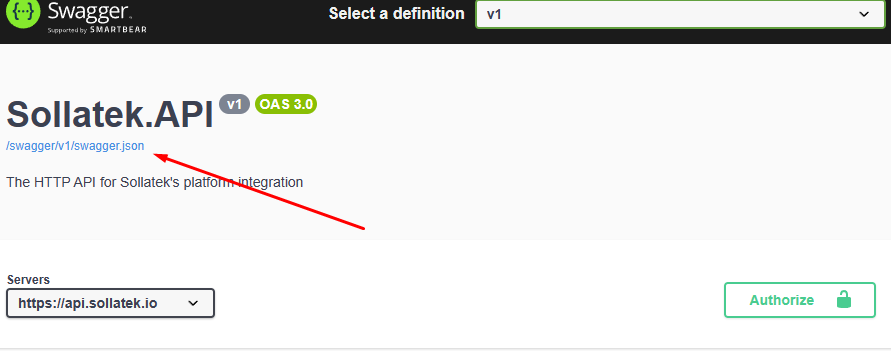
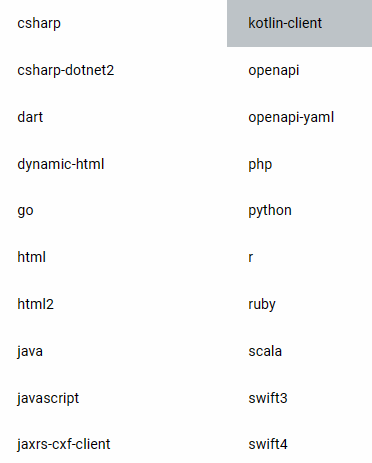

# Sollatek.DataSync

Sollatek.DataSync is a .NET worker application that reads selected Sollatek Platform API entities and writes them to a configured target:

- SQL Server, PostgreSQL, or MySQL relational tables.
- MongoDB collections.
- Portal export files on the local/container filesystem.
- Portal export files in Azure Blob Storage.

The worker is configured from `appsettings.json`, .NET user secrets, command-line arguments, or environment variables prefixed with `SOL_`.

## Quick Start

Use this path when you only want to run the application.

### 1. Choose A Provider

Set `Storage:provider` to one of:

| Provider | Target | Connection string required |
| --- | --- | --- |
| `sqlserver` | SQL Server tables | Yes |
| `postgres` | PostgreSQL tables | Yes |
| `mysql` | MySQL tables | Yes |
| `mongo` | MongoDB collections | Yes |
| `filesystem` | Portal export files | No |
| `azureBlobStorage` | Portal export blobs | Optional; depends on `Storage:authentication` |

The default executable includes every storage provider and no optional monitoring provider. Provider-specific published builds are described in [Publish For Deployment](#publish-for-deployment).

### 2. Configure Credentials

For local development, use .NET user secrets. The project already has `UserSecretsId` set to `Sollatek_datasync`, so `dotnet user-secrets init` is not needed.

```powershell
dotnet user-secrets set "Settings:clientKey" "YourClientKey" --project .\Sollatek.DataSync\Sollatek.DataSync.csproj
dotnet user-secrets set "Settings:clientSecret" "YourClientSecret" --project .\Sollatek.DataSync\Sollatek.DataSync.csproj
```

For deployment, use `appsettings.json`, command-line arguments, or environment variables:

```powershell
$env:SOL_Settings__clientKey="YourClientKey"
$env:SOL_Settings__clientSecret="YourClientSecret"
```

`Settings:oauthUrl` defaults to `https://id.sollatek.io/` in `appsettings.json`.
`Settings:apiUrl` defaults to `https://api.sollatek.io/`.

### 3. Configure Storage

Choose one storage target. Full provider examples are in [Storage](#storage).

SQL Server example:

```powershell
dotnet user-secrets set "Storage:provider" "sqlserver" --project .\Sollatek.DataSync\Sollatek.DataSync.csproj
dotnet user-secrets set "Storage:connectionString" "Server=localhost;Database=sollatek_datasync;User Id=sa;Password=YourStrongPassword;Encrypt=False;TrustServerCertificate=True;" --project .\Sollatek.DataSync\Sollatek.DataSync.csproj
dotnet user-secrets set "Storage:schemaMode" "applySafeChanges" --project .\Sollatek.DataSync\Sollatek.DataSync.csproj
```

Filesystem example:

```json
{
  "Storage": {
    "provider": "filesystem"
  },
  "FileExport": {
    "rootPath": ".artifacts/exports",
    "statePath": "_state/sync-state.json",
    "format": "parquet",
    "folderFormat": "yyyyMM",
    "fileNameFormat": "{entity}_{date:yyyyMMdd}.{format}"
  }
}
```

Azure Blob uses the same `FileExport` layout as filesystem storage:

```json
{
  "Storage": {
    "provider": "azureBlobStorage",
    "connectionString": "DefaultEndpointsProtocol=https;AccountName=...;AccountKey=...;EndpointSuffix=core.windows.net",
    "containerName": "exports"
  },
  "FileExport": {
    "rootPath": "exports",
    "statePath": "_state/sync-state.json",
    "format": "parquet",
    "folderFormat": "yyyyMM",
    "fileNameFormat": "{entity}_{date:yyyyMMdd}.{format}"
  },
  "State": {
    "provider": "azureBlobStorage",
    "rootPath": "_state"
  }
}
```

### 4. Configure What To Sync

`SyncPlan` controls exactly which API entities are synced and in which order. DataSync does not add dependencies automatically. If the plan contains only `assets`, only assets are fetched and stored.

Small example:

```json
{
  "SyncPlan": [
    {
      "assets": {
        "initial": "full",
        "dataMode": "full",
        "outputName": "Assets"
      }
    },
    {
      "rawDataTemperaturedata": {
        "initial": "differential",
        "outputName": "Temperature"
      }
    }
  ]
}
```

See [SyncPlan Policies](#syncplan-policies) for selectors, per-entity policies, and environment variable syntax.

### 5. Configure Schedule

```json
{
  "Sync": {
    "runOnStartup": true,
    "stopWhenFinished": false,
    "runInterval": "06:00:00",
    "schedule": {
      "mode": "fixedDelay"
    },
    "maxPageSize": 500,
    "apiRequestTimeout": "00:05:00",
    "startFrom": null,
    "initial": "differential"
  }
}
```

For daily, weekly, monthly, hourly, and `historicalOnly` examples, see [Sync](#sync).

### 6. Run

```powershell
dotnet run --project .\Sollatek.DataSync\Sollatek.DataSync.csproj
```

For a deployed executable:

```powershell
$env:SOL_Storage__provider="sqlserver"
$env:SOL_Storage__connectionString="Server=localhost;Database=sollatek_datasync;User Id=sa;Password=YourStrongPassword;Encrypt=False;TrustServerCertificate=True;"
$env:SOL_Settings__clientKey="YourClientKey"
$env:SOL_Settings__clientSecret="YourClientSecret"
.\Sollatek.DataSync
```

## Configuration Reference

### Storage

`Storage:connectionString` is the preferred connection-string key. `ConnectionStrings:DataSync` and the old `Settings:dbConnection` key are still accepted as fallbacks.

Supported runtime providers:

| `Storage:provider` value | Required storage keys | Notes |
| --- | --- | --- |
| `sqlserver` | `connectionString` | Uses relational tables and `Storage:schemaMode`. |
| `postgres` | `connectionString` | Uses relational tables and `Storage:schemaMode`. |
| `mysql` | `connectionString` | Uses relational tables and `Storage:schemaMode`. |
| `mongo` | `connectionString` | Uses MongoDB collections. |
| `filesystem` | None | Writes export files under `FileExport:rootPath`. |
| `azureBlobStorage`, `azureBlob`, `blob` | Depends on `Storage:authentication` | Writes export objects to Azure Blob Storage. `FileExport:rootPath` is the blob prefix. |

Azure Blob authentication options:

| `Storage:authentication` value | Required keys | Notes |
| --- | --- | --- |
| `connectionString` | `connectionString`, `containerName` | Default when `Storage:connectionString` is present. |
| `containerUri` | `containerUri` | Use a container URI that includes SAS permissions for read, write, create, list, and delete when blob-backed state is enabled. |
| `defaultAzureCredential` | `containerUri`, or `accountName` plus `containerName`, or `blobServiceUri` plus `containerName` | Uses Azure Identity. `managedIdentity` is accepted as an alias; set `managedIdentityClientId` for a user-assigned managed identity. |

Connection string examples:

```json
{
  "Storage": {
    "provider": "sqlserver",
    "connectionString": "Server=localhost;Database=sollatek_datasync;User Id=sa;Password=YourStrongPassword;Encrypt=False;TrustServerCertificate=True;",
    "schemaMode": "validate"
  }
}
```

```json
{
  "Storage": {
    "provider": "postgres",
    "connectionString": "Host=localhost;Port=5432;Database=sollatek_datasync;Username=postgres;Password=YourPassword;SSL Mode=Prefer;Trust Server Certificate=true;",
    "schemaMode": "validate"
  }
}
```

```json
{
  "Storage": {
    "provider": "mysql",
    "connectionString": "Server=localhost;Port=3306;Database=sollatek_datasync;User Id=root;Password=YourPassword;SslMode=Preferred;",
    "schemaMode": "validate"
  }
}
```

```json
{
  "Storage": {
    "provider": "mongo",
    "connectionString": "mongodb://localhost:27017/sollatek_datasync"
  }
}
```

```json
{
  "Storage": {
    "provider": "filesystem"
  },
  "FileExport": {
    "rootPath": ".artifacts/exports",
    "statePath": "_state/sync-state.json",
    "format": "parquet",
    "folderFormat": "yyyyMM",
    "fileNameFormat": "{entity}_{date:yyyyMMdd}.{format}"
  }
}
```

```json
{
  "Storage": {
    "provider": "azureBlobStorage",
    "connectionString": "DefaultEndpointsProtocol=https;AccountName=...;AccountKey=...;EndpointSuffix=core.windows.net",
    "containerName": "exports"
  },
  "FileExport": {
    "rootPath": "exports",
    "statePath": "_state/sync-state.json",
    "format": "parquet",
    "folderFormat": "yyyyMM",
    "fileNameFormat": "{entity}_{date:yyyyMMdd}.{format}"
  }
}
```

Azure Blob SAS container URI example:

```json
{
  "Storage": {
    "provider": "azureBlobStorage",
    "authentication": "containerUri",
    "containerUri": "https://storageacct.blob.core.windows.net/exports?<sas-token>"
  }
}
```

Azure Blob managed identity example:

```json
{
  "Storage": {
    "provider": "azureBlobStorage",
    "authentication": "defaultAzureCredential",
    "accountName": "storageacct",
    "containerName": "exports",
    "managedIdentityClientId": "11111111-1111-1111-1111-111111111111"
  }
}
```

`Storage:schemaMode` is only used by relational providers. `filesystem` and `azureBlobStorage` skip database migrations.

### Sync

`Sync` controls startup behavior, scheduling, API paging, request timeouts, and the default initial-load policy.

| Key | Default | Values | Notes |
| --- | --- | --- | --- |
| `Sync:runOnStartup` | `true` | `true`, `false`, `historicalOnly` | `historicalOnly` runs immediately only up to the current completed schedule period, then continues on the configured schedule. |
| `Sync:stopWhenFinished` | `false` | `true`, `false` | Use `true` for one-shot jobs started by an external scheduler. |
| `Sync:runInterval` | `06:00:00` | Positive `TimeSpan` | Used by `fixedDelay` schedules. |
| `Sync:schedule:mode` | `fixedDelay` | `fixedDelay`, `hourly`, `daily`, `weekly`, `monthly` | Calendar schedules use UTC and export up to the completed period boundary. |
| `Sync:maxPageSize` | `500` | Positive integer | Paged API request size and maximum rows per local write part. |
| `Sync:apiRequestTimeout` | `00:05:00` | Positive `TimeSpan` | Timeout for one paged API request. |
| `Sync:startFrom` | January 1 of the current UTC year | Date/time | Bootstrap lower bound for empty targets when the entity is not `initial: "full"`. |
| `Sync:initial` | `differential` | `differential`, `full` | Default for `SyncPlan` entries without their own `initial`. |
| `Sync:transferMode` | `asyncExport` | `asyncExport`, `pagedApi` | Export providers normally use portal async export. |

Fixed delay example for SQL, MongoDB, or any continuous worker that should run every six hours:

```json
{
  "Sync": {
    "runOnStartup": true,
    "stopWhenFinished": false,
    "runInterval": "06:00:00",
    "schedule": {
      "mode": "fixedDelay"
    }
  }
}
```

Daily historical export example. If started on `2026-06-22` at any time after midnight UTC, the startup historical run ends at `2026-06-22T00:00:00Z`, so daily export windows cover completed days only:

```json
{
  "Sync": {
    "runOnStartup": "historicalOnly",
    "stopWhenFinished": false,
    "schedule": {
      "mode": "daily",
      "time": "01:00:00"
    },
    "startFrom": "2026-03-22",
    "initial": "full"
  }
}
```

Other calendar schedule examples:

```json
{
  "Sync": {
    "schedule": {
      "mode": "hourly",
      "minute": 15
    }
  }
}
```

```json
{
  "Sync": {
    "schedule": {
      "mode": "weekly",
      "dayOfWeek": "Monday",
      "time": "02:00:00"
    }
  }
}
```

```json
{
  "Sync": {
    "schedule": {
      "mode": "monthly",
      "dayOfMonth": 1,
      "time": "03:00:00"
    }
  }
}
```

### SyncPlan Policies

Per-entity policy values are configured on object-style `SyncPlan` entries. `FileExport:entities` is no longer supported; startup fails if that legacy section is present.

Supported entity selectors:

- Exact metadata keys, for example `rawDataBatteryperiods`.
- Normalized raw-data paths, for example `rawdata/batteryperiods`.
- Operation paths, for example `/api/RawData/batteryperiods`.
- Legacy raw-data aliases when they resolve to one entity, for example `locationData`.

If a selector is unknown, empty, duplicated, or matches multiple entities, startup fails with a clear error.

- `initial`: `differential` or `full`. Default: `Sync:initial`, then `differential`. `full` removes the watermark filter only when the selected target has no stored data for that entity.
- `dataMode`: `differential` or `full`. Filesystem and Azure Blob only. Default: `differential`. `full` removes the watermark filter every time that entity is exported.
- `partitionDate`: `watermarkDay` or `exportRunDay`. Filesystem and Azure Blob only. Default: `watermarkDay`.
- `outputName`: Filesystem and Azure Blob only. Optional display name used by `{entity}` in file export path formats. Defaults to the metadata entity key.

Example with a full asset export every run and differential temperature export using the global `Sync:initial` default:

```json
{
  "Sync": {
    "startFrom": "2026-03-22",
    "initial": "full"
  },
  "SyncPlan": [
    {
      "assets": {
        "dataMode": "full",
        "outputName": "Assets"
      }
    },
    {
      "rawDataTemperaturedata": {
        "initial": "differential",
        "outputName": "Temperature"
      }
    }
  ]
}
```

For environment variables and containers, `SyncPlan:entities` can replace the JSON array with a comma, semicolon, or newline separated entity list:

```powershell
$env:SOL_SyncPlan__entities="customers;devices;pointsOfInterest;assets;rawdata/locationdata;rawdata/extrainfodata;rawdata/temperaturedata;rawdata/dooropeningdata"
```

`SyncPlan:entities` can only carry entity names. It cannot carry `initial`, `dataMode`, `partitionDate`, or `outputName`.

### File Export

Filesystem and Azure Blob storage use `FileExport` to decide where portal export files are saved.

- `FileExport:format`: portal export format for filesystem or Azure Blob async export. Supported values: `csv`, `xml`, `xlsx`, and `parquet`. Paged API local writing supports `csv` and `parquet`.
- `FileExport:folderFormat`: folder path under `FileExport:rootPath`. Defaults to `{entityKey}/year={date:yyyy}/month={date:MM}/day={date:dd}`. A value without `{...}` tokens is treated as a `DateOnly` format, so `yyyyMM` renders `202602`.
- `FileExport:fileNameFormat`: file name under the rendered folder. Defaults to `part-{part:000000}.{format}`.
- `FileExport:statePath`: local DataSync checkpoint state path. Defaults to `_state/sync-state.json` under the running app base directory. Relative paths are resolved from the running app base directory, not from `FileExport:rootPath`. When `State:provider` is `azureBlobStorage`, checkpoints are stored in blob state instead.
- Supported path tokens: `{entity}`, `{entityKey}`, `{date}`, `{date:<format>}`, `{yyyy}`, `{MM}`, `{dd}`, `{part}`, `{part:<format>}`, and `{format}`.

Filesystem and Azure Blob async export preserve the portal export schema for the selected `FileExport:format`. They do not rename, remove, or coerce columns to match historical sample files. If a downstream consumer requires a legacy/sample schema, add an explicit projection/translation layer for that contract instead of relying on direct portal-file copy.

Use `partitionDate: "exportRunDay"` for telemetry-style late arrivals. For example, data exported on 15/06 is stored under the 15/06 folder even when the event timestamp is from 12/06.

Daily file organization example, producing paths such as `202602/Assets_20260202.parquet` and `202602/Temperature_20260203.parquet`:

```json
{
  "FileExport": {
    "rootPath": ".artifacts/exports",
    "statePath": "_state/sync-state.json",
    "format": "parquet",
    "folderFormat": "yyyyMM",
    "fileNameFormat": "{entity}_{date:yyyyMMdd}.{format}"
  }
}
```

Use `{part:000000}` when one entity/day can produce more than one file:

```json
{
  "FileExport": {
    "rootPath": ".artifacts/exports",
    "format": "csv",
    "folderFormat": "{entity}/yyyyMM",
    "fileNameFormat": "{entity}_{date:yyyyMMdd}_part-{part:000000}.{format}"
  }
}
```

Complete daily filesystem export example:

```json
{
  "Storage": {
    "provider": "filesystem"
  },
  "Sync": {
    "runOnStartup": "historicalOnly",
    "stopWhenFinished": false,
    "schedule": {
      "mode": "daily",
      "time": "01:00:00"
    },
    "startFrom": "2026-03-22",
    "initial": "full"
  },
  "SyncPlan": [
    {
      "assets": {
        "dataMode": "full",
        "outputName": "Assets"
      }
    },
    {
      "rawDataTemperaturedata": {
        "initial": "differential",
        "outputName": "Temperature"
      }
    }
  ],
  "FileExport": {
    "rootPath": ".artifacts/exports",
    "statePath": "_state/sync-state.json",
    "format": "parquet",
    "folderFormat": "yyyyMM",
    "fileNameFormat": "{entity}_{date:yyyyMMdd}.{format}"
  }
}
```

For Azure Blob Storage, keep the same `Sync`, `SyncPlan`, and `FileExport` layout and replace only the storage target. The example below writes blobs under the `daily/` prefix in the `exports` container:

```json
{
  "Storage": {
    "provider": "azureBlobStorage",
    "connectionString": "DefaultEndpointsProtocol=https;AccountName=...;AccountKey=...;EndpointSuffix=core.windows.net",
    "containerName": "exports"
  },
  "FileExport": {
    "rootPath": "daily",
    "statePath": "_state/sync-state.json",
    "format": "parquet",
    "folderFormat": "yyyyMM",
    "fileNameFormat": "{entity}_{date:yyyyMMdd}.{format}"
  },
  "State": {
    "provider": "azureBlobStorage",
    "rootPath": "_state"
  }
}
```

### State Storage

Provider state locations:

- SQL Server, PostgreSQL, MySQL: `__sollatek_datasync_state`.
- MongoDB: `__sollatek_datasync_state`.
- Filesystem: `<FileExport:statePath>`, defaulting to `<app base>/_state/sync-state.json`.
- Azure Blob with default state settings: `<FileExport:statePath>`, defaulting to `<app base>/_state/sync-state.json`.
- Azure Blob with `State:provider` set to `azureBlobStorage`: blobs under `<State:rootPath>` in the same configured export container.

This state store is DataSync-owned operational metadata. It must be writable even when relational `Storage:schemaMode` is `validate`.

`State` is optional. The default is filesystem state. Blob-backed state is available only when `Storage:provider` is `azureBlobStorage`; startup fails if it is configured for SQL, MongoDB, or filesystem storage.

```json
{
  "State": {
    "provider": "azureBlobStorage",
    "rootPath": "_state"
  }
}
```

With blob-backed state, DataSync writes:

- `_state/sync-state.json` for successful range checkpoints.
- `_state/async-exports/state/<request-key>.json` for pending async portal export requests.

Downloaded portal export files are still temporary local files under `AsyncExport:statePath/downloads` while the current process reads them. If the process restarts after a state document is saved but the temporary file is gone, DataSync polls the existing export request and downloads the file again when the portal still has it.

Before using a stored state value, DataSync checks whether the selected target has data for that entity:

- Relational providers check table existence and then query for one row.
- MongoDB queries for one document in the target collection.
- Filesystem and Azure Blob export checks for existing export files under the entity export folder/prefix.

If the target is empty, DataSync ignores old state for that entity. Entities configured with `initial: "full"` run without a watermark filter; other entities start from `Sync:startFrom`.

For relational and MongoDB targets with existing data, DataSync reads the latest stored watermark from the target and uses it as the next cycle start. Those providers use bounded API filters from the start watermark to the planned run end, split into one-day ranges for large differential windows. If no stored watermark is available, DataSync uses the state-store value. Filesystem and Azure Blob targets use the state-store value once data exists.

### Retry

```json
{
  "Retry": {
    "maxTries": 3,
    "period": "00:05:00",
    "delayFunction": "linear"
  }
}
```

`Retry:delayFunction` values:

- `fixed`: next retry time is `now + period`.
- `linear`: next retry time is `now + tryNumber * period`.

### Failure Email Notifications

Failure email is optional. If `Notifications:failureEmail` is absent or disabled, DataSync does not send mail. When enabled, one SMTP email is sent only after a sync run exhausts `Retry:maxTries`; transient failures that are still waiting for another retry do not send email.

```json
{
  "Notifications": {
    "failureEmail": {
      "enabled": true,
      "smtpHost": "smtp.example.com",
      "smtpPort": 587,
      "enableSsl": true,
      "username": "datasync-smtp-user",
      "password": "set-with-user-secrets-or-environment",
      "from": "datasync@example.com",
      "to": "ops@example.com;dev@example.com",
      "subjectPrefix": "[DataSync]"
    }
  }
}
```

`to` can be a comma/semicolon/newline separated string or a configuration array. For deployment, keep `username` and `password` out of source-controlled files and set them through user secrets, environment variables, or the hosting platform secret store:

```powershell
$env:SOL_Notifications__failureEmail__enabled="true"
$env:SOL_Notifications__failureEmail__smtpHost="smtp.example.com"
$env:SOL_Notifications__failureEmail__from="datasync@example.com"
$env:SOL_Notifications__failureEmail__to="ops@example.com"
$env:SOL_Notifications__failureEmail__username="datasync-smtp-user"
$env:SOL_Notifications__failureEmail__password="..."
```

If SMTP sending fails, DataSync logs that notification failure and continues its normal exhausted-retry behavior, including stopping when `Sync:stopWhenFinished=true` or scheduling the next run otherwise.

### Async Export

```json
{
  "AsyncExport": {
    "format": "parquet",
    "pollInterval": "00:01:00",
    "maxParallelRequests": 10,
    "maxSubmissions": 60,
    "submissionWindow": "00:05:00",
    "rateLimitRetryDelay": "00:05:00",
    "statePath": ".artifacts/async-exports"
  }
}
```

For filesystem and Azure Blob storage, `FileExport:format` is used as the async portal export format when `AsyncExport:format` is not set. `maxParallelRequests` controls concurrent polling/downloading work. `maxSubmissions` and `submissionWindow` throttle new portal export submissions using a rolling window, so the example allows 60 submissions per 5 minutes. `rateLimitRetryDelay` is used when the portal returns HTTP 429 without a `Retry-After` header. `maxSubmissionsPerHour` is still accepted as a legacy alias for old configs and maps to a one-hour window. `AsyncExport:statePath` is the local async-export workspace by default; when Azure Blob state is enabled, durable pending-request state moves to blobs and this path is still used for temporary downloaded export files.

## Monitoring

DataSync is a worker process. Current status is observable through console logs, an optional local HTTP status endpoint, and optional OpenTelemetry export.

Console logging and the in-process monitor are always available. External monitoring sinks are build-time optional so deployments only carry what they use:

| Monitoring build value | Included monitoring packages |
| --- | --- |
| `none` | No OTLP, Azure Monitor, or status HTTP endpoint packages |
| `otlp` | OTLP exporter |
| `azuremonitor` | Azure Monitor/Application Insights exporter |
| `status` | HTTP status endpoint |
| `otlp-status` | OTLP exporter and HTTP status endpoint |
| `azuremonitor-status` | Azure Monitor/Application Insights exporter and HTTP status endpoint |
| `otlp-azuremonitor` | OTLP and Azure Monitor/Application Insights exporters |
| `otlp-azuremonitor-status` | OTLP, Azure Monitor/Application Insights, and HTTP status endpoint |
| `all` | All monitoring providers |

If a runtime `Monitoring` section enables a provider that was not included in the published build, startup fails with a clear message.

The built-in monitor records:

- Run state: idle, running, processing entity, waiting to retry, failed, succeeded.
- Current entity and its active range.
- Schedule mode, next scheduled run time, planned range end, expected completed range end, and backlog lag.
- Retry attempt and next retry time.
- Last error summary.
- Records, pages, and files processed.
- Async export queue counts: pending, polling, downloaded, processing, failed, and expired.
- Managed heap, total allocated bytes, working set, private memory, and peak working set.

### Console Logs

Console logging is always registered. Use `Logging:LogLevel` to make the console more or less verbose:

```json
{
  "Logging": {
    "LogLevel": {
      "Default": "Information",
      "Microsoft": "Warning",
      "Microsoft.Hosting.Lifetime": "Information",
      "System.Net.Http.HttpClient": "Warning"
    }
  }
}
```

Less output:

```powershell
$env:SOL_Logging__LogLevel__Default="Warning"
```

More diagnostic output:

```powershell
$env:SOL_Logging__LogLevel__Default="Debug"
```

Disable sync monitor progress/status log events while keeping normal application logs:

```powershell
$env:SOL_Monitoring__structuredLogsEnabled="false"
```

### Status Endpoint

The status endpoint package is not included in the default `none` monitoring build. Publish with `DataSyncMonitoringProvider=status`, `otlp-status`, `azuremonitor-status`, `otlp-azuremonitor-status`, or `all` before enabling it at runtime.

The status endpoint is disabled by default. Enable it when another process should poll current worker status:

```powershell
$env:SOL_Monitoring__statusEndpoint__enabled="true"
$env:SOL_Monitoring__statusEndpoint__url="http://127.0.0.1:5055"
```

Default paths:

- `GET /status`: current `SyncRunStatus` as JSON.
- `GET /health`: `{ "status": "ok" }`.

The status payload includes the current entity, counters, last error, retry timing, and memory fields:
`managedHeapBytes`, `totalAllocatedBytes`, `workingSetBytes`, `privateMemoryBytes`, and `peakWorkingSetBytes`.

Backlog/status fields:

- `scheduleMode`: `fixeddelay`, `hourly`, `daily`, `weekly`, or `monthly`.
- `nextRunAtUtc`: when the worker is next scheduled to start.
- `plannedRangeEndUtc`: upper bound for the current or most recently planned run.
- `expectedCompletedRangeEndUtc`: latest completed period boundary according to the schedule.
- `currentRangeStartUtc` and `currentRangeEndUtc`: range currently being processed.
- `lastCompletedRangeEndUtc`: latest successfully completed range end after a run succeeds.
- `lagSeconds`: seconds between the current/completed range and `expectedCompletedRangeEndUtc`.
- `lagPeriods`: schedule periods behind, rounded up. For a daily schedule, `2` means roughly two daily export windows remain.
- `plannedEntityCount`: number of entities planned for the current run.

Async export queue fields:

- `asyncExportsPending`
- `asyncExportsPolling`
- `asyncExportsDownloaded`
- `asyncExportsProcessing`
- `asyncExportsFailed`
- `asyncExportsExpired`

In containers, bind only to an internal/private interface unless the endpoint is intentionally exposed:

```powershell
$env:SOL_Monitoring__statusEndpoint__url="http://0.0.0.0:5055"
```

### Metrics And OTLP

Metrics are enabled in-process by default through `System.Diagnostics.Metrics`, but they are exported only when OTLP or Azure Monitor export is enabled and the matching provider package is included in the published build. The DataSync meter name defaults to `sollatek-datasync` through `Monitoring:serviceName`.

Common metrics after OTLP-to-Prometheus conversion:

- `datasync_worker_state`
- `datasync_retry_attempt`
- `datasync_records_processed`
- `datasync_pages_processed`
- `datasync_files_processed`
- `datasync_lag_seconds`
- `datasync_lag_periods`
- `datasync_async_exports_pending`
- `datasync_async_exports_polling`
- `datasync_async_exports_downloaded`
- `datasync_async_exports_processing`
- `datasync_async_exports_failed`
- `datasync_async_exports_expired`
- `datasync_runs_started_total`
- `datasync_runs_succeeded_total`
- `datasync_runs_failed_total`
- `datasync_entities_started_total`
- `datasync_retries_scheduled_total`
- `datasync_memory_managed_heap`
- `datasync_memory_total_allocated`
- `datasync_memory_working_set`
- `datasync_memory_private`
- `datasync_memory_peak_working_set`

Enable OTLP metrics:

```powershell
dotnet publish .\Sollatek.DataSync\Sollatek.DataSync.csproj -c Release -p:DataSyncMonitoringProvider=otlp
$env:SOL_Monitoring__otlp__enabled="true"
$env:SOL_Monitoring__otlp__metricsEnabled="true"
$env:SOL_Monitoring__otlp__endpoint="http://localhost:4317"
$env:SOL_Monitoring__otlp__protocol="grpc"
```

OTLP logs are off by default. Enable them only when your collector is ready to receive logs:

```powershell
$env:SOL_Monitoring__otlp__logsEnabled="true"
```

For OTLP HTTP/protobuf, configure signal-specific endpoints:

```powershell
$env:SOL_Monitoring__otlp__protocol="httpProtobuf"
$env:SOL_Monitoring__otlp__metricsEndpoint="http://localhost:4318/v1/metrics"
$env:SOL_Monitoring__otlp__logsEndpoint="http://localhost:4318/v1/logs"
```

### Prometheus And Grafana

The repository includes a local observability stack:

```powershell
docker compose -f docker-compose.observability.yml up -d
```

Local endpoints:

- OpenTelemetry Collector health: `http://localhost:13133`
- Collector Prometheus exporter: `http://localhost:8889/metrics`
- Prometheus: `http://localhost:9090`
- Grafana: `http://localhost:3000`

The stack provisions a Prometheus datasource and a `Sollatek DataSync` Grafana dashboard. DataSync sends OTLP to the collector; Prometheus scrapes the collector; Grafana reads from Prometheus.

For a DataSync container outside the observability compose network, use Docker Desktop's host endpoint:

```powershell
$env:SOL_Monitoring__otlp__endpoint="http://host.docker.internal:4317"
```

For a DataSync container on the same Docker network as the collector:

```powershell
$env:SOL_Monitoring__otlp__endpoint="http://otel-collector:4317"
```

Safe local checks:

```powershell
curl.exe http://localhost:13133
curl.exe http://localhost:8889/metrics
curl.exe http://localhost:9090/-/ready
curl.exe http://localhost:3000/api/health
```

The local observability stack files are under `observability`.

### Application Insights / Azure Monitor

DataSync can export metrics and logs directly to Azure Monitor/Application Insights when the published build includes `DataSyncMonitoringProvider=azuremonitor`, `azuremonitor-status`, `otlp-azuremonitor`, `otlp-azuremonitor-status`, or `all`.

Enable direct export explicitly. `APPLICATIONINSIGHTS_CONNECTION_STRING` can supply the connection string, but it does not enable Azure Monitor by itself:

```powershell
dotnet publish .\Sollatek.DataSync\Sollatek.DataSync.csproj -c Release -p:DataSyncMonitoringProvider=azuremonitor
$env:SOL_Monitoring__azureMonitor__enabled="true"
$env:APPLICATIONINSIGHTS_CONNECTION_STRING="InstrumentationKey=...;IngestionEndpoint=..."
```

You can also set the connection string through explicit `SOL_` settings:

```powershell
$env:SOL_Monitoring__azureMonitor__enabled="true"
$env:SOL_Monitoring__azureMonitor__connectionString="InstrumentationKey=...;IngestionEndpoint=..."
$env:SOL_Monitoring__azureMonitor__metricsEnabled="true"
$env:SOL_Monitoring__azureMonitor__logsEnabled="true"
```

Logs are disabled by default to avoid surprise ingestion volume. Set `Monitoring:azureMonitor:logsEnabled=true` when logs should be sent to Application Insights.

## Deployment

For an Azure portal walkthrough that deploys DataSync as a 01:00 UTC daily Container Apps Job writing to Azure Blob Storage, see [Deploy DataSync As An Azure Container Apps Daily Blob Job](AZURE_CONTAINER_APPS_DAILY_BLOB_JOB.md). The guide also covers private/internal-only storage accounts where the deployment script must skip blob container data-plane setup.

### Docker Runtime

Build the default container image from the repository root. It includes all storage providers and no optional monitoring providers:

```powershell
docker build -f .\Sollatek.DataSync\Dockerfile -t sollatek-datasync:local .
```

Include monitoring providers by setting `DATASYNC_MONITORING_PROVIDER`. The status endpoint uses ASP.NET Core hosting, so use the ASP.NET runtime image when that provider is included:

```powershell
docker build -f .\Sollatek.DataSync\Dockerfile -t sollatek-datasync:local --build-arg DATASYNC_MONITORING_PROVIDER=otlp .
docker build -f .\Sollatek.DataSync\Dockerfile -t sollatek-datasync:local --build-arg DATASYNC_MONITORING_PROVIDER=status --build-arg DOTNET_RUNTIME_IMAGE=aspnet .
```

The Dockerfile fails the build with a clear error if a status endpoint monitoring provider is selected without `DOTNET_RUNTIME_IMAGE=aspnet`.

`docker-compose.datasync.example.yml` shows filesystem export with a named volume mapped to `/app/volumes/webapi/exports`.

The Docker image sets:

```text
FileExport__rootPath=/app/volumes/webapi/exports
```

and declares `/app/volumes/webapi/exports` as a volume so exported files are not tied to the container writable layer.

### Hosting Scenarios

DataSync can run either as a continuous worker or as a platform-scheduled one-shot job.

Use a continuous worker when the host process should stay alive and schedule its own cycles:

```json
{
  "Sync": {
    "runOnStartup": true,
    "stopWhenFinished": false,
    "runInterval": "06:00:00"
  }
}
```

Use a platform-scheduled job when Azure, AWS, Google Cloud, Kubernetes, cron, or another scheduler starts the process on a timer:

```json
{
  "Sync": {
    "runOnStartup": true,
    "stopWhenFinished": true
  }
}
```

Run only one active DataSync instance per target database or export folder unless an external lock is added. Multiple instances can fetch the same range and compete for the same state. For scheduled jobs, set the platform schedule interval longer than the normal sync duration, or configure the scheduler/orchestrator to prevent overlapping executions.

### Hosting Memory Profile

Memory depends on export format, selected entities, portal export size, provider, and `AsyncExport:maxParallelRequests`. Do not set a host memory limit exactly at the observed peak; leave headroom for TLS buffers, provider clients, GC behavior, and larger customer datasets.

Observed daily historical filesystem profile:

| Date | Provider | Window | Plan | Format | Samples | Peak working set | Peak private memory | Result |
| --- | --- | --- | --- | --- | ---: | ---: | ---: | --- |
| 2026-06-23 | `filesystem` | `2026-05-23T00:00:00Z` to `2026-06-23T00:00:00Z` | full daily assets and daily temperature export | `parquet` | 766 | 121.49 MiB | 72.85 MiB | Completed, 60 files saved |

Use at least `512Mi` for small single-worker filesystem exports. Prefer `1Gi` or more for production deployments until the exact customer `SyncPlan`, export sizes, and provider have been profiled. Increase memory further when using `xlsx` or `xml`, large entities, higher parallelism, or multiple hosted workers.

The attempted all-provider profile on 2026-06-23 was stopped before completion because the portal kept the sampled asset export in `processing` for more than one hour and returned no `downloadId`. The partial local process sample reached 127.97 MiB peak working set while waiting for portal exports, but SQL Server, PostgreSQL, MySQL, MongoDB, and Azure Blob provider write paths were not reached in that run, so no verified provider-specific peak memory numbers are documented for those providers yet.

| Environment | Continuous worker | Scheduled one-shot job | Notes |
| --- | --- | --- | --- |
| Azure | Azure Container Apps app, Azure App Service container, AKS deployment, or VM service. | Azure Container Apps job with a schedule trigger. | Container Apps jobs support manual, scheduled, and event-driven executions. Use Azure SQL, Azure Database for PostgreSQL/MySQL, MongoDB-compatible hosting, or a mounted persistent share for filesystem exports. |
| AWS | ECS service on Fargate/EC2, EKS deployment, or EC2 system service. | EventBridge Scheduler invoking an ECS `RunTask` target. | EventBridge Scheduler supports rate, cron, and one-time schedules for ECS tasks. Use RDS/Aurora, DocumentDB/MongoDB-compatible hosting where appropriate, or EFS for filesystem exports. |
| Google Cloud | GKE deployment or Compute Engine system service. | Cloud Run job executed on a schedule. | Cloud Run jobs are designed for finite tasks. Use Cloud SQL, MongoDB-compatible hosting where appropriate, or a mounted/shared filesystem for exports. |
| Self-hosted | Docker Compose, Kubernetes deployment, systemd service, or Windows service. | Kubernetes CronJob, host cron, Task Scheduler, or a CI/CD scheduler. | Keep secrets outside source control. For filesystem exports, mount `/app/volumes/webapi/exports` or set `FileExport:rootPath` to a durable path. |

References:

- [Azure Container Apps jobs](https://learn.microsoft.com/en-us/azure/container-apps/jobs)
- [Amazon ECS scheduled tasks with EventBridge Scheduler](https://docs.aws.amazon.com/AmazonECS/latest/developerguide/tasks-scheduled-eventbridge-scheduler.html)
- [Google Cloud Run jobs](https://cloud.google.com/run/docs/create-jobs)
- [Google Cloud Run jobs on a schedule](https://cloud.google.com/run/docs/execute/jobs-on-schedule)

### Publish For Deployment

Publish with the .NET SDK:

```powershell
dotnet publish .\Sollatek.DataSync\Sollatek.DataSync.csproj -c Release -r win-x64 --self-contained true -p:PublishSingleFile=true -o .\publish
```

Common runtime identifiers:

- Windows x64: `win-x64`
- Linux x64: `linux-x64`
- macOS x64: `osx-x64`
- macOS ARM64: `osx-arm64`

The `scripts` folder contains Docker-based publish scripts for machines that should not install the .NET SDK locally. Each script takes a storage provider parameter and an optional monitoring provider parameter, then exports a self-contained single-file application:

```powershell
.\scripts\publish-datasync-windows.ps1 sqlserver
.\scripts\publish-datasync-windows.ps1 filesystem -MonitoringProvider otlp-status
```

```bash
./scripts/publish-datasync-linux.sh postgres
./scripts/publish-datasync-macos.sh mongo osx-arm64 "" Release azuremonitor
```

Default output path:

```text
.artifacts/publish/datasync-<provider>-<runtime>
```

When a non-`none` monitoring provider is selected and no custom output path is supplied, the default output path is:

```text
.artifacts/publish/datasync-<provider>-<monitoring-provider>-<runtime>
```

Publish provider values:

| Publish provider value | Provider packages included | Runtime `Storage:provider` values available in that build |
| --- | --- | --- |
| `all` | SQL, MongoDB, filesystem, Azure Blob | `sqlserver`, `postgres`, `mysql`, `mongo`, `filesystem`, `azureBlobStorage` |
| `sql` | SQL | `sqlserver`, `postgres`, `mysql` |
| `sqlserver` | SQL | `sqlserver`, `postgres`, `mysql` |
| `mssql` | SQL | `sqlserver`, `postgres`, `mysql` |
| `postgres` | SQL | `sqlserver`, `postgres`, `mysql` |
| `mysql` | SQL | `sqlserver`, `postgres`, `mysql` |
| `mongo` | MongoDB | `mongo` |
| `mongodb` | MongoDB | `mongo` |
| `filesystem` | Filesystem | `filesystem` |
| `files` | Filesystem | `filesystem` |
| `azureblob` | Azure Blob | `azureBlobStorage` |
| `azureblobstorage` | Azure Blob | `azureBlobStorage` |
| `blob` | Azure Blob | `azureBlobStorage` |

The publish storage provider controls what persistence code is included in the executable. The runtime `Storage:provider` setting controls what the executable uses when it starts. The publish monitoring provider controls which optional monitoring packages are included. Runtime monitoring settings only work when their provider was included in the published build.

## Build And Test

Use this path when you want to build, test, or modify the project.

### Prerequisites

- .NET SDK 10, matching `global.json`.
- Docker, only for Docker publish scripts, local database containers, or the local observability stack.

### Restore, Build, Test

```powershell
dotnet restore .\Sollatek.DataSync.sln
dotnet build .\Sollatek.DataSync.sln -c Release --no-restore
dotnet test .\Sollatek.DataSync.sln --no-restore --verbosity minimal
```

Local Docker database services for provider testing:

```powershell
docker compose -f docker-compose.datasync-tests.yml up -d
```

### Project Structure

- `Sollatek.DataSync`: executable worker and scheduling.
- `Sollatek.DataSync.Abstractions`: shared contracts, configuration, state, monitoring, and storage abstractions.
- `Stores\Sollatek.DataSync.Sql`: SQL Server, PostgreSQL, and MySQL provider implementation.
- `Stores\Sollatek.DataSync.Mongo`: MongoDB provider implementation.
- `Stores\Sollatek.DataSync.Filesystem`: filesystem/Parquet provider implementation.
- `Stores\Sollatek.DataSync.AzureBlob`: Azure Blob export provider implementation.
- `Monitoring\Sollatek.DataSync.Monitoring.OpenTelemetry`: shared OpenTelemetry wiring for monitoring providers.
- `Monitoring\Sollatek.DataSync.Monitoring.Otlp`: OTLP monitoring provider.
- `Monitoring\Sollatek.DataSync.Monitoring.AzureMonitor`: Azure Monitor/Application Insights monitoring provider.
- `Monitoring\Sollatek.DataSync.Monitoring.StatusEndpoint`: HTTP status endpoint monitoring provider.
- `Platform.ApiClient`: generated API client.
- `tests`: unit and provider tests, grouped by project.
- `observability`: local OpenTelemetry Collector, Prometheus, and Grafana configuration.
- `scripts`: Docker-based publish scripts.

The worker orchestration is separate from persistence. A custom host can reference only `Sollatek.DataSync.Abstractions` plus the provider package it needs, then register that provider through `DataSyncStorageProviderRegistry`.

### API Client And Swagger

The API client is generated from Sollatek Platform swagger documents. The default runtime configuration reads:

```json
{
  "SwaggerDocuments": [
    {
      "name": "data-v1",
      "url": "https://api.sollatek.io/swagger/data-v1/swagger.json"
    },
    {
      "name": "portal-v1",
      "url": "https://api.sollatek.io/swagger/portal-v1/swagger.json"
    }
  ]
}
```



Other client generators can read the same swagger documents:

- [NSwag](https://github.com/RicoSuter/NSwag)
- [Swagger Codegen](https://github.com/swagger-api/swagger-codegen)
- [Swagger Editor](https://editor.swagger.io/)



## License

This project is source-available under the MIT License with Commons Clause. You may use, copy, modify, publish, and distribute the code, including modified versions, but you may not sell the software itself. Because selling the software is restricted, this is not an OSI open-source license. See [LICENCE.md](LICENCE.md) for the full terms.
